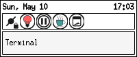
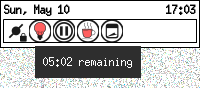
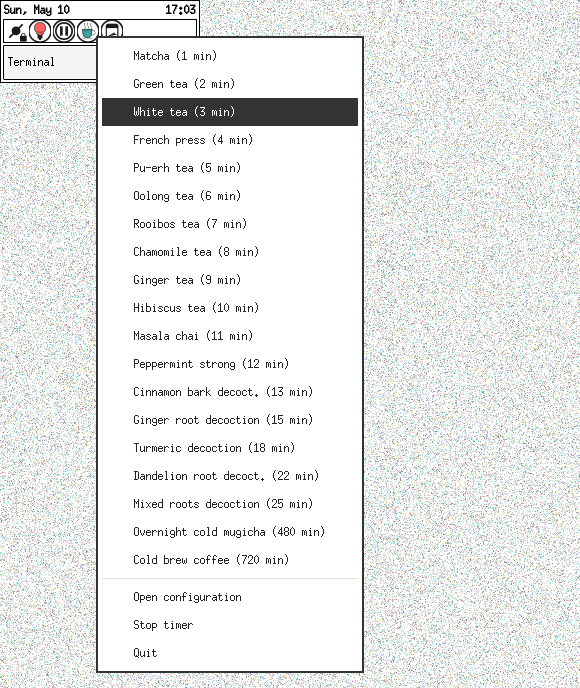

`gteatime` -- A lightweight GTK 3 system-tray tea and coffee timer
==================================================================

`gteatime` (*tea & coffee timer*) is a GTK 3 systray timer for tea and
coffee presets written in C.  It avoids `GtkStatusIcon` and
`libappindicator`.  The tray integration first tries
`StatusNotifierItem` over D-Bus using GIO, then falls back to the
`XEmbed` system tray protocol on X11.

   - **Last update:** Mon May 11 00:22 UTC 2026
   - **Current version:** 1.0.2

It was inspired by KDE’s classic `kteatime`, which I used in the early
2000s before moving from that desktop environment to Openbox and
a GTK3-only setup.

- Timer off and timer on (with tooltip) icons on systray:

<!--  -->

## Dependencies

  - `libgtk-3-dev`
  - `libx11-dev`
  - `pkgconf` (for `Makefile`)

On Debian-like systems:

    sudo apt install pkgconf libgtk-3-dev libx11-dev

## Build

    make

## Local run

    ./bin/gteatime

## Install

Installation of the binary and the three needed icons can be done with:

    make install

By default it will be installed in `usr/local/bin`, but that can be
changed using, of course, the `PREFIX` standard.  To install it in
`/usr/bin`, use:

    make PREFIX=/usr/ install

Icons can be copied into any theme.  Under `scalable/apps` is a good
place.  For example: `~/.local/share/icons/my_icon_theme/scalable/apps/`.
There are only three icons:

  - `gteatime.svg`  -- program icon
  - `gteatime-on.svg` -- systray running icon
  - `gteatime-off.svg` -- systray idle icon

Although, the "on" and "off" icons are for the systray, and maybe it
will be better to put them in the directory `scalable/status`.

## Uninstall

    make uninstall

But if the program was installed by modifying the `PREFIX` directory, it
has to be specified as well, and in the same way, when invoking
`uninstall`.

## Desktop support

This program requires either a desktop component that implements the
`StatusNotifierItem` watcher protocol, or an X11 tray manager that owns
`_NET_SYSTEM_TRAY_Sn` (where *n* is the X11 screen number).  KDE
Plasma usually supports `StatusNotifierItem` directly.  XFCE and other
X11 panels usually support the fallback tray.  GNOME on Wayland normally
requires a tray or `StatusNotifierItem` extension.

No `AppIndicator` API was used.

## Behavior

- Left click on the tray item opens the configuration window.
- Right click on the tray item opens the preset menu.
- Closing the window hides it and leaves the timer in the systray.
- The tray tooltip shows remaining time, or an idle message when no
  timer is running.
- A D-Bus desktop notification is shown when the timer completes.

## Style notes

The code is written as C99-compliant.

Most editable program constants, including icon names, user-visible
identity strings, and tray protocol names, are in `include/defs.h`.

## Author

  - J. A. Corbal <jacorbal@gmail.com>
